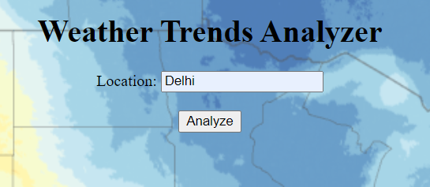
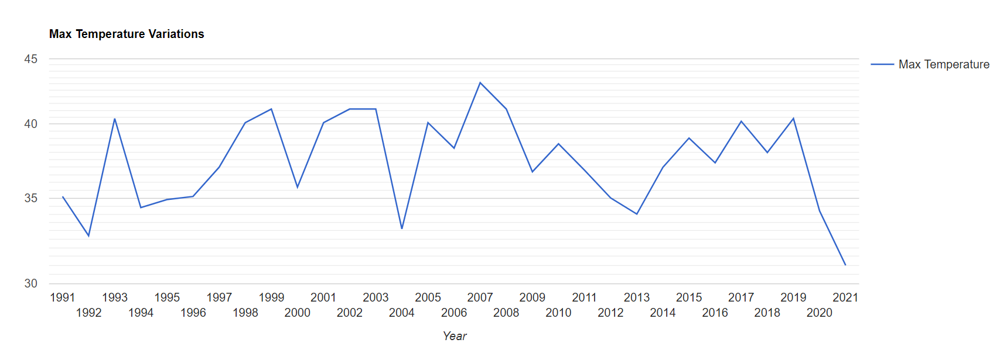
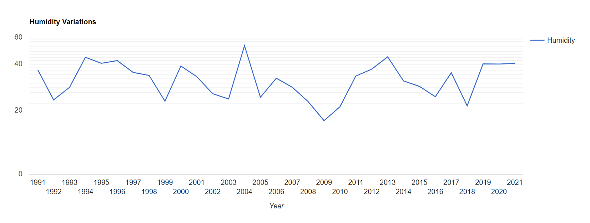
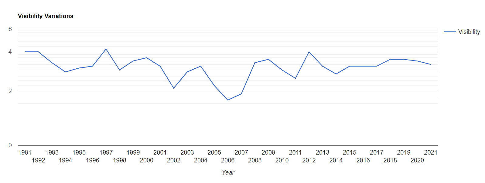
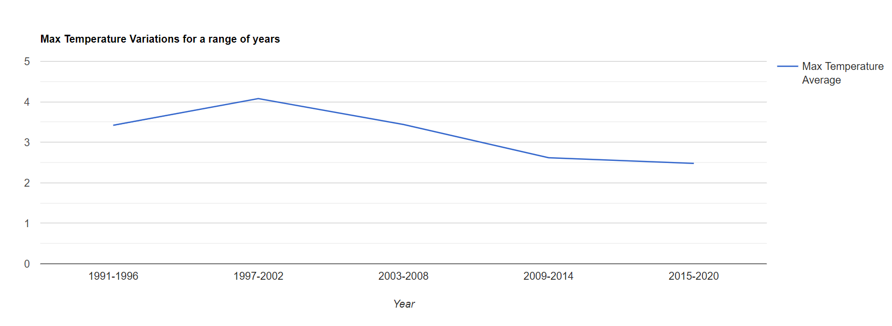
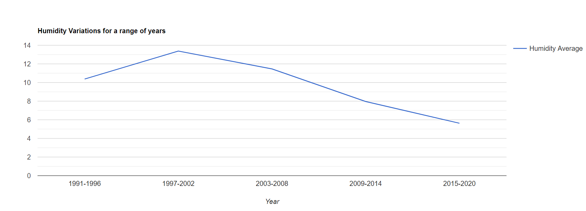
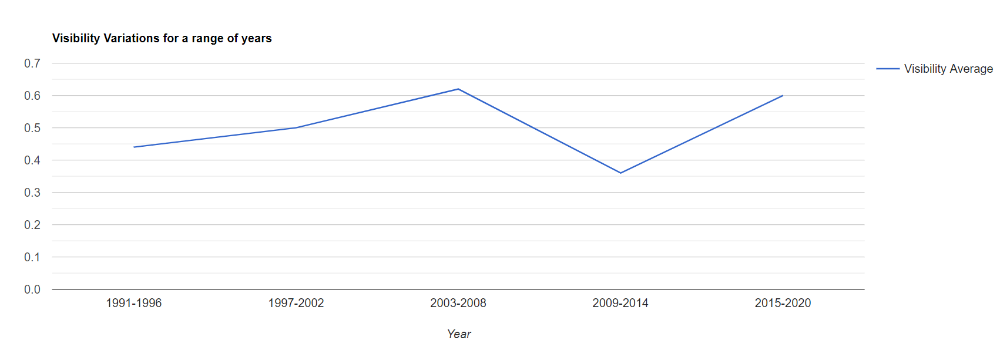

# Weather-Trends-Analyser
A web application that shows the trends of maximum temperature, humidity and visibility for a particular location; finds the major for climate change and determines the risk zone that particular location belongs to.

We used [Visual crossing](https://visualcrossing.com/) weather API for our project.

This project uses is based on Micro-service architecture and it use 3 micro-services.

## Authors
- [Saran Sappa](https://github.com/saransappa)
- [Mullapudi Taraka Vignesh](https://github.com/mtarakavignesh)
- [Mudili Sandeep Naidu](https://github.com/sandeepnaidumudili)
- [Gurijala Venkata Sai Sundar](https://github.com/7h3r4v3n)

## Output
- ### Our User Interface

### Our analysis for Delhi
- ### Temperature trends

- ### Humidity trends

- ### Visibility trends

- ### Temperature trends over a range of years

- ### Humidity trends over a range of years

- ### Visibility trends over a range of years

